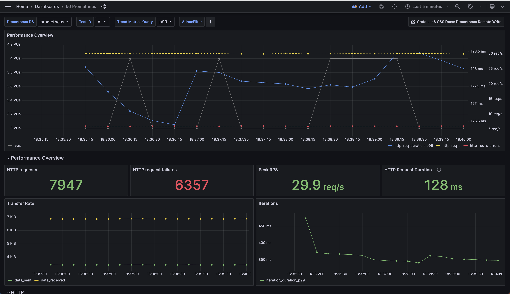

# xk6-output-prometheus-remote

> [!WARNING]
> The `xk6-output-prometheus-remote` extension [has been merged](https://github.com/grafana/k6/pull/4519) to the [main k6 repository](https://github.com/grafana/k6). Please contribute and [open issues there](https://github.com/grafana/k6/issues). This repository is no longer maintained.

The `xk6-output-prometheus-remote` extension allows you to publish test-run metrics to Prometheus via Remote Write endpoint.

> :warning: Be careful not to confuse this with the [Prometheus Remote Write **client** extension](https://github.com/grafana/xk6-client-prometheus-remote) which is used for load and performance testing of _Prometheus_ itself.

As of k6 v0.42.0, this extension is available within [k6](https://github.com/grafana/k6) as an _experimental module_. For further details, read the [extension graduation guide](https://k6.io/docs/extensions/explanations/extension-graduation/).


## Usage

Consult the [Prometheus remote write guide in the k6 docs](https://k6.io/docs/results-output/real-time/prometheus-remote-write/) to explore the various methods and options for sending k6 metrics to a Prometheus remote-write endpoint. 

## Development

For developing or testing this extension, you can build a k6 binary with the local extension using [xk6](https://github.com/grafana/xk6) with the following steps:

```bash
xk6 build --with github.com/grafana/xk6-output-prometheus-remote=. 
```

For more details, refer to the k6 docs:
- [Build a k6 binary using Go](https://k6.io/docs/extensions/guides/build-a-k6-binary-using-go/)
- [k6 output extensions](https://k6.io/docs/extensions/get-started/create/output-extensions/)

## Dashboards

<p>&nbsp;</p>

[](./images/dashboard-k6-prometheus.png)

This repo contains the [source code](./grafana/dashboards) of two Grafana dashboards designed to visualize test results: [`k6 Prometheus`](https://grafana.com/grafana/dashboards/19665-k6-prometheus/) and [k6 Prometheus (Native Histograms)](https://grafana.com/grafana/dashboards/18030-k6-prometheus-native-histograms/). 

Visit the [documentation](https://k6.io/docs/results-output/real-time/prometheus-remote-write/#time-series-visualization) to learn more about these dashboards. You can import them to your Grafana instance or with the docker-compose example on this repo. 

🌟 Special thanks to [jwcastillo](https://github.com/jwcastillo) for his contributions and dedication to improving the dashboards. 
